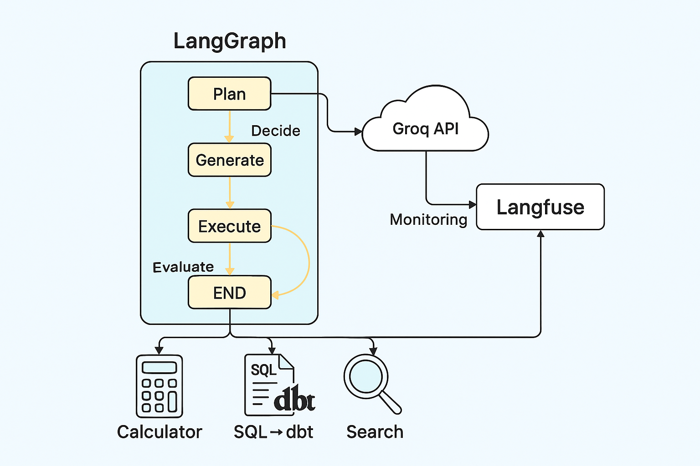

# AI Agents
This repository demonstrates the implementation of AI Agents for various tasks such as calculations, SQL-to-DBT conversion, and intelligent search. It also includes evaluation, monitoring, and Streamlit-based UI for interaction.


## Setup Instructions
### 1. Create Virtual Environment and Install Dependencies
Run below commands in your IDE from project root directory
```bash

# Create virtual environment
python -m venv .venv

# Activate the environment (Windows)
.\.venv\Scripts\activate

# Navigate to project folder
cd aiagents

# Install requirements

```

### 2. Configure Environment Variables
Create a .env file in the root directory and add your API keys or configuration variables as needed.

```env

DEBUG=false
GROQ_API_KEY=<>
LLM_MODEL=llama-3.1-8b-instant

LANGFUSE_SECRET_KEY=<>
LANGFUSE_PUBLIC_KEY=<>
LANGFUSE_HOST=https://us.cloud.langfuse.com
TEMPERATURE=0.2
GROQ_ENDPOINT=https://api.groq.com/openai/v1/chat/completions
DBT_DIR=<>

```

## Running the Project
Run Evaluation Harness

```bash

python -m evaluation.evaluate

```

## Run Streamlit App
Set the PYTHONPATH to the project directory and start Streamlit:

```bash

# From parent directory
$env:PYTHONPATH="<project-root-directory>\aiagents"

# Run Streamlit app
streamlit run aiagents/streamlit_individual_app.py

## For the universal app
streamlit run aiagents/streamlit_universal_app.py

```

## Features

### Tools
- calc_agent.py → Perform calculations
- sql2dbt_agent.py → Convert SQL queries to DBT models
- search_agent.py → Intelligent search capabilities

### Monitoring

Integrated with Langfuse for observability

### Evaluation

Harness for testing agent performance

### Streamlit UI

- Individual app: Select tools manually
- Universal app: Provide prompt and let the system decide

## Documentation

Refer to docs/architecture.md and docs/langgraph_flow.png for detailed architecture and flow diagrams.

## Langgraph Flow




## Project Structure

<pre>

aiagents/
├── README.md
├── __init__.py
├── requirements.txt
├── config.py
├── .env
├── graph.py
├── streamlit_individual_app.py   # Choose the radio button to use the tool
├── streamlit_universal_app.py    # Provide the prompt & let it decide which tool to use
├── tools/
│   ├── __init__.py
│   ├── calc_agent.py
│   ├── sql2dbt_agent.py
│   ├── search_agent.py
│
├── monitoring/
│   ├── __init__.py
│   ├── monitor.py   # Langfuse integration
│
├── evaluation/
│   ├── __init__.py
│   ├── evaluate.py
│
├── utils/
│   ├── __init__.py
│   ├── state.py
│   ├── prompts.py
│   ├── logger.py
│
├── tests/
│   ├── test_calc_agent.py
│   ├── test_sql2dbt_agent.py
│   ├── test_graph.py
│
└── docs/
    ├── architecture.md
    ├── langgraph_flow.png

<pre>
